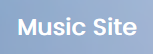

<!-- Improved compatibility of back to top link: See: https://github.com/othneildrew/Best-README-Template/pull/73 -->

<!--
*** Thanks for checking out the Best-README-Template. If you have a suggestion
*** that would make this better, please fork the repo and create a pull request
*** or simply open an issue with the tag "enhancement".
*** Don't forget to give the project a star!
*** Thanks again! Now go create something AMAZING! :D
-->

<!-- PROJECT SHIELDS -->
<!--
*** I'm using markdown "reference style" links for readability.
*** Reference links are enclosed in brackets [ ] instead of parentheses ( ).
*** See the bottom of this document for the declaration of the reference variables
*** for contributors-url, forks-url, etc. This is an optional, concise syntax you may use.
*** https://www.markdownguide.org/basic-syntax/#reference-style-links
-->

<!-- PROJECT LOGO -->
 

  

<h3 align="center">Music Site</h3>

  

    5th Lab Activity: Building a Music-Themed Website
Objective: Develop a music-themed website showcasing your favorite music
genre, artists, or instruments. Incorporate advanced CSS techniques and
responsive design to ensure the website is visually appealing, functional, and
accessible on various devices.
     
    <a href="https://github.com/PaulPableoSectionC/lab5_Music_Themed_website"><strong>Explore the docs »</strong></a>
     
     
    <a href="https://ppableo.github.io/music-client/">View Demo</a>
  

<!-- TABLE OF CONTENTS -->

  
Table of Contents

  <ol>
    <li>
      <a href="#about-the-project">About The Project</a>
      <ul>
        <li><a href="#built-with">Built With</a></li>
      </ul>
    </li>
    <li>
      <a href="#getting-started">Getting Started</a>
      <ul>
        <li><a href="#Design">Design Choices</a></li>
      </ul>
    </li>
    <li><a href="#roadmap">Roadmap</a></li>
    <li><a href="#acknowledgments">Acknowledgments</a></li>
  </ol>

<!-- ABOUT THE PROJECT -->
## About The Project
[![Product Name Screen Shot][product-screenshot]](https://ppableo.github.io/music-client/)

(<a href="#readme-top">back to top</a>)

### Built With

* [![HTML5][Next.js]][Next-url]
* [![Vue][Vue.js]][Vue-url]

(<a href="#readme-top">back to top</a>)

<!-- GETTING STARTED -->
## Getting Started

<h2>Intial Setup</h2>
We were given an objective to create a Music-Themed Website showcasing our favorite music, genre, artists, or instruments. We had an assignment prior where we created a basic layout and how now moved on to creating more complex layouts. We are also asked to use CSS variables for colors, font sizes, margins, in addition to fluid typography, font integration, and responsiveness. We were given the initial design, to recreate the layout and given creative freedom.

[![Product Name Screen Shot][product-screenshot2]]

I first took the initial layout and planned my direction by sectioning and dividing the design. By drawing out boxes I'm able to visualize my semantic elements like header, footer, nav, section, and articles. Once I completed my initial setup, I moved on to setting up my folders, files, and code. With a basic webpage setup, it was time to add my variables, colors, and normalization to give myself a blank canvas and foundation.

<h2>Code and Layout</h2>

Started with basic layout, by creating basic layout with a wrapper to control max-size of webpage. I took my navigation from past exercise and transfer over and apply it to this design

 

Started creating sections and debated on wether to use flex-box or grid for this featured artists section. I ended up trying both, and settled on sticking with grid to keep the number of rows and columns consistent for responsiveness. The new release initial design I was able to replicate but because i wanted consistency with my theme and design I decided to give them cards as well. These both sections took the longest as I played with both flex options and testing there responsiveness

## Design

With the creative freedom we were given my thought process was a Spotify with Apple UI design. I've wanted to recreate a textured, gradient blur. When it came to being responsive I also wanted to create a horizontal scroll, similar to different types of music players

(<a href="#readme-top">back to top</a>)

<!-- ROADMAP -->
## Roadmap

- Multi-Page
- Mobile-Menu
- Feedback
    - Apply Feedback

(<a href="#readme-top">back to top</a>)

<!-- ACKNOWLEDGMENTS -->
## Acknowledgments

* [Readme-Template] (README template)
* [Artists-and-Songs] (Various Artists and Songs mentioned in this demo)
* [Professor-GabA] (Layout and Feedback)

(<a href="#readme-top">back to top</a>)

<!-- MARKDOWN LINKS & IMAGES -->
<!-- https://www.markdownguide.org/basic-syntax/#reference-style-links -->
[Readme-Template]: https://github.com/othneildrew/Best-README-Template
[Artists-and-Songs]: https://www.youtube.com/
[Professor-GabA]: https://github.com/GAlbuHumber
[contributors-shield]: https://img.shields.io/github/contributors/PaulPableoSectionC/lab5_Music_Themed_website.svg?style=for-the-badge
[contributors-url]: https://github.com/PaulPableoSectionC/lab5_Music_Themed_website/graphs/contributors
[forks-shield]: https://img.shields.io/github/forks/PaulPableoSectionC/lab5_Music_Themed_website.svg?style=for-the-badge
[forks-url]: https://github.com/PaulPableoSectionC/lab5_Music_Themed_website/network/members
[stars-shield]: https://img.shields.io/github/stars/PaulPableoSectionC/lab5_Music_Themed_website.svg?style=for-the-badge
[stars-url]: https://github.com/PaulPableoSectionC/lab5_Music_Themed_website/stargazers
[issues-shield]: https://img.shields.io/github/issues/PaulPableoSectionC/lab5_Music_Themed_website.svg?style=for-the-badge
[issues-url]: https://github.com/PaulPableoSectionC/lab5_Music_Themed_website/issues
[license-shield]: https://img.shields.io/github/license/PaulPableoSectionC/lab5_Music_Themed_website.svg?style=for-the-badge
[license-url]: https://github.com/PaulPableoSectionC/lab5_Music_Themed_website/blob/master/LICENSE.txt
[linkedin-shield]: https://img.shields.io/badge/-LinkedIn-black.svg?style=for-the-badge&logo=linkedin&colorB=555
[linkedin-url]: https://linkedin.com/in/linkedin_username
[product-screenshot]: ./assets/music_site.webp
[product-screenshot2]: ./assets/image1.png
[Next.js]: https://img.shields.io/badge/HTML5-000000?style=for-the-badge&logo=HTML5&logoColor=white
[Next-url]: https://nextjs.org/
[Vue.js]: https://img.shields.io/badge/CSS-35495E?style=for-the-badge&CSS&logoColor=4FC08D
[Vue-url]: https://vuejs.org/